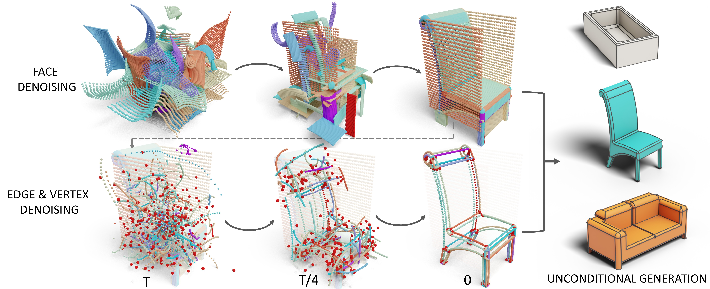

# BrepGen: A B-rep Generative Diffusion Model with Structured Latent Geometry (SIGGRAPH 2024)

[](https://arxiv.org/abs/2401.15563)
[](https://brepgen.github.io) 
[](https://www.youtube.com/xxx)

*[Xiang Xu](https://samxuxiang.github.io/), [Joseph Lambourne](https://www.research.autodesk.com/people/joseph-george-lambourne/),
[Pradeep Jayaraman](https://www.research.autodesk.com/people/pradeep-kumar-jayaraman/), [Zhengqing Wang](https://www.linkedin.com/in/zhengqing-wang-485854241/?originalSubdomain=ca), [Karl Willis](https://www.karlddwillis.com/), and [Yasutaka Furukawa](https://yasu-furukawa.github.io/)*



> We present a diffusion-based generative approach that directly outputs a CAD B-rep. BrepGen uses a novel structured latent geometry to encode the CAD geometry and topology. A top-down generation approach is used to denoise the faces, edges, and vertices. 


## Requirements

### Environment (Tested)
- Linux
- Python 3.9
- CUDA 11.8 
- PyTorch 2.2 
- Diffusers 0.27


### Dependencies

Install PyTorch and other dependencies:
```
conda create --name brepgen_env python=3.9 -y
conda activate brepgen_env

pip install -r requirements.txt
pip install chamferdist
```

If `chamferdist` fails to install here are a few options to try:

- If there is a CUDA version mismatch error, then try setting the `CUDA_HOME` environment variable to point to CUDA installation folder. The CUDA version of this folder must match with PyTorch's version i.e. 11.8.

- Try [building from source](https://github.com/krrish94/chamferdist?tab=readme-ov-file#building-from-source).

Install OCCWL following the instruction [here](https://github.com/AutodeskAILab/occwl).
If conda is stuck in "Solving environment..." there are two options to try:

- Try using `mamba` as suggested in occwl's README.

- Install pythonOCC: https://github.com/tpaviot/pythonocc-core?tab=readme-ov-file#install-with-conda and occwl manually: `pip install git+https://github.com/AutodeskAILab/occwl`.

## Data
Download [ABC](https://archive.nyu.edu/handle/2451/43778) STEP files (100 folders), or the [Furniture Data](https://drive.google.com/file/d/16nXl7OXOZtPxRhkGobOezDTXiBisEVs2/view?usp=sharing). 

The faces, edges, and vertices need to be extracted from the STEP files.  

Process the B-reps (under ```data_process``` folder):

    sh process.sh


Remove repeated CAD models (under ```data_process``` folder, default is ```6 bit``` ):

    sh deduplicate.sh

You can download the deduplicated files for [DeepCAD](https://drive.google.com/drive/folders/1N_60VCZKYgPviQgP8lwCOVXrzu9Midfe?usp=drive_link), [ABC](https://drive.google.com/drive/folders/1bA90Rz5EcwaUhUrgFbSIpgdJ0aeDjy3v?usp=drive_link), and [Furniture](https://drive.google.com/drive/folders/13TxFFSXqT4IgyIwO4z6gbm4jg3JrnbZL?usp=drive_link).


## Training 
Train the surface and edge VAE (wandb for logging):

    sh train_vae.sh

Train the latent diffusion model (change path to previously trained VAEs):

    sh train_ldm.sh

```--cf``` classifier-free training for the Furniture dataset. 

```--data_aug``` randomly rotate the CAD model during training (optional).


## Generation and Evaluation
Randomly generate B-reps from Gaussian noise, both STEP and STL files will be saved:

    python sample.py --mode abc

This will load  the settings in ```eval_config.yaml```. Make sure to update model paths to the correct folder. 

Run this script for evaluation (change the path to generated data folder, with at least 3,000 samples):

    sh eval.sh
    
This computes the JSD, MMD, and COV scores. Please also download sampled point clouds for [test set](https://drive.google.com/drive/folders/1kqxSDkS2gUN9_qpuWotFDhl4t7czbfOc?usp=sharing). 


## Pretrained Checkpoint
We also provide the individual checkpoints trained on different datasets. 
| **Source Dataset** |  |   |                                                 
|--------------------|-----------| -----------|
| DeepCAD | [vae model](https://drive.google.com/drive/folders/1UZYqJ2EmTjzeTcNr_NL3bPpU4WrufvQa?usp=drive_link) |   [latent diffusion model](https://drive.google.com/drive/folders/1jonuCzoTBFOKKlnaoGlbmhT6YlnH0lma?usp=drive_link) |
| ABC | [vae model](https://drive.google.com/drive/folders/18Ib9L0kpFf4ylZIRTCYFhXZB_GVIUm53?usp=drive_link) |   [latent diffusion model](https://drive.google.com/drive/folders/1hv7ZUcU-L3J0LiONK60-TEh7sAN0zfve?usp=drive_link) |
| Furniture | [vae model](https://drive.google.com/drive/folders/1HT5h8b6mxcgBfz0Ciwue8nANcKgmRTd-?usp=drive_link) |   [latent diffusion model](https://drive.google.com/drive/folders/1NxuZ9en6yWSkmb2pBQ97aFlWvtBSNnjU?usp=drive_link) |


## Acknowledgement
This research is partially supported by NSERC Discovery Grants with Accelerator Supplements and DND/NSERC Discovery Grant
Supplement, NSERC Alliance Grants, and John R. Evans Leaders Fund (JELF). We also thank Onshape for their support and access of
the publicly available CAD models.


## Citation
If you find our work useful in your research, please cite the following paper
```
@article{xu2024brepgen,
  title={BrepGen: A B-rep Generative Diffusion Model with Structured Latent Geometry},
  author={Xu, Xiang and Lambourne, Joseph G and Jayaraman, Pradeep Kumar and Wang, Zhengqing and Willis, Karl DD and Furukawa, Yasutaka},
  journal={arXiv preprint arXiv:2401.15563},
  year={2024}
}
```
